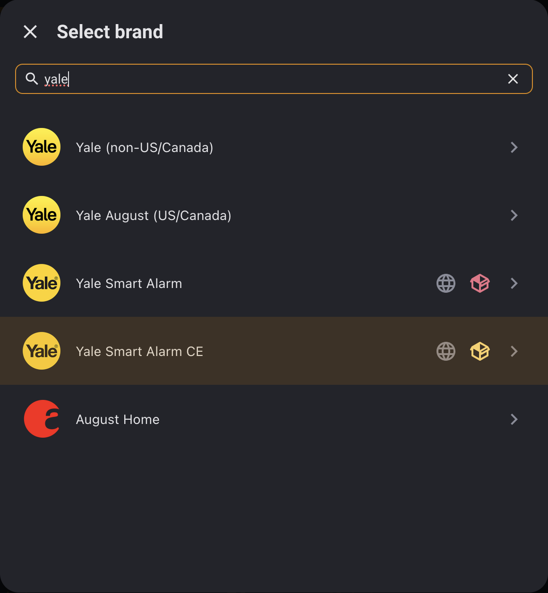
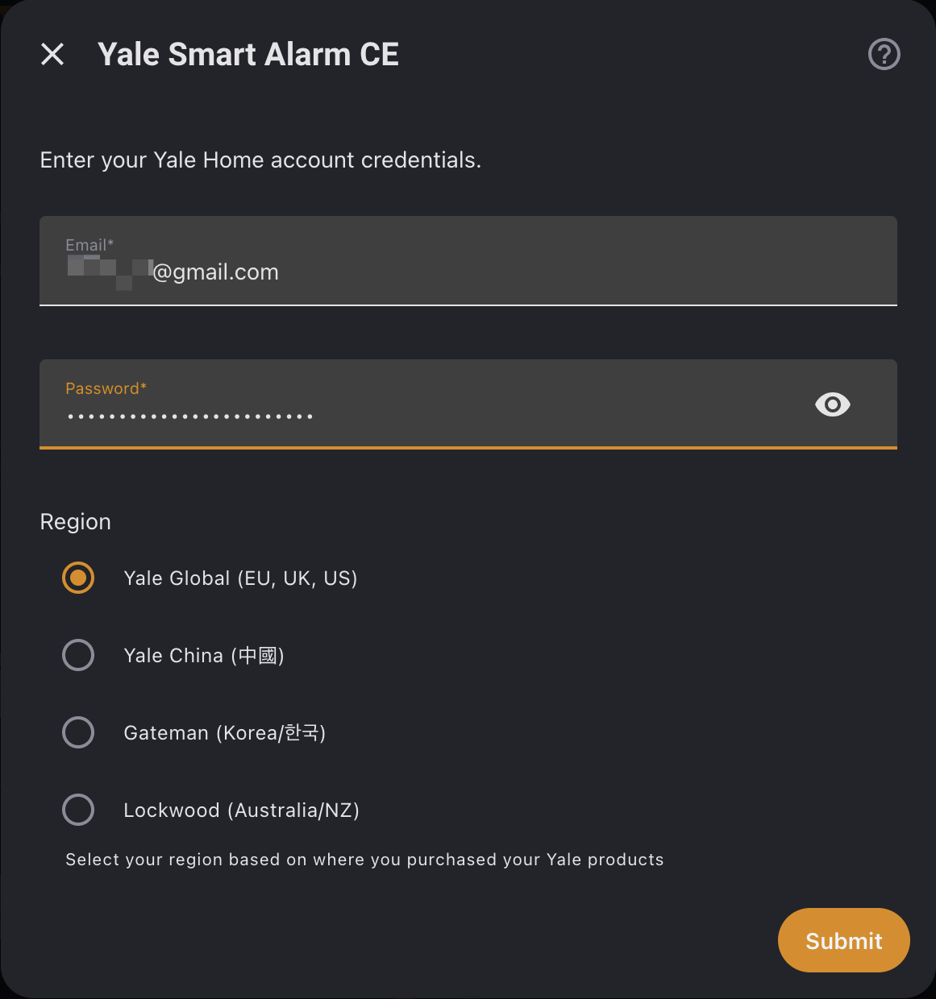
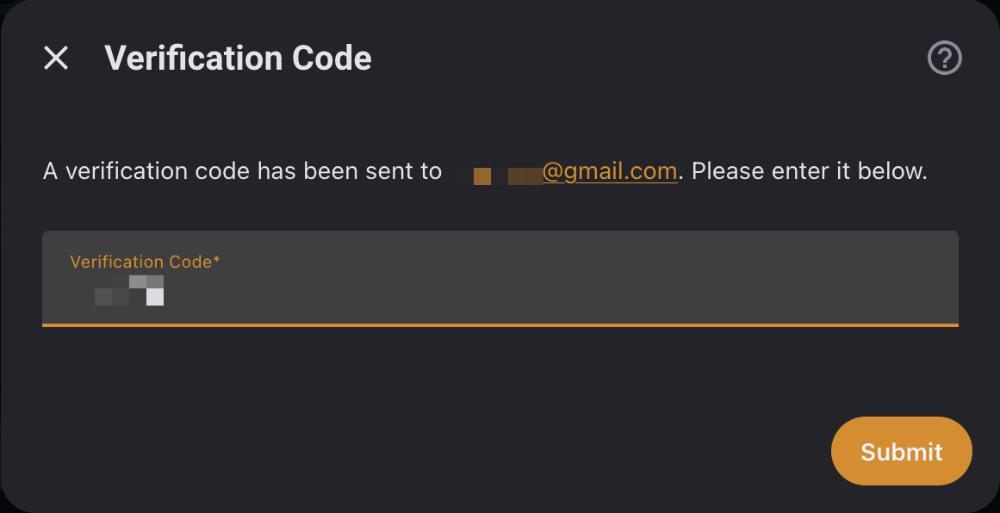
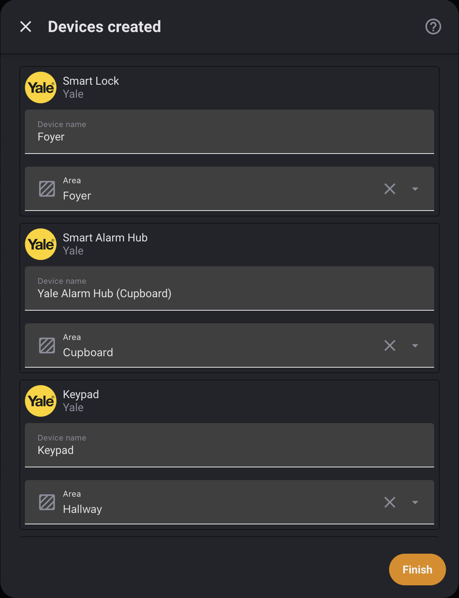
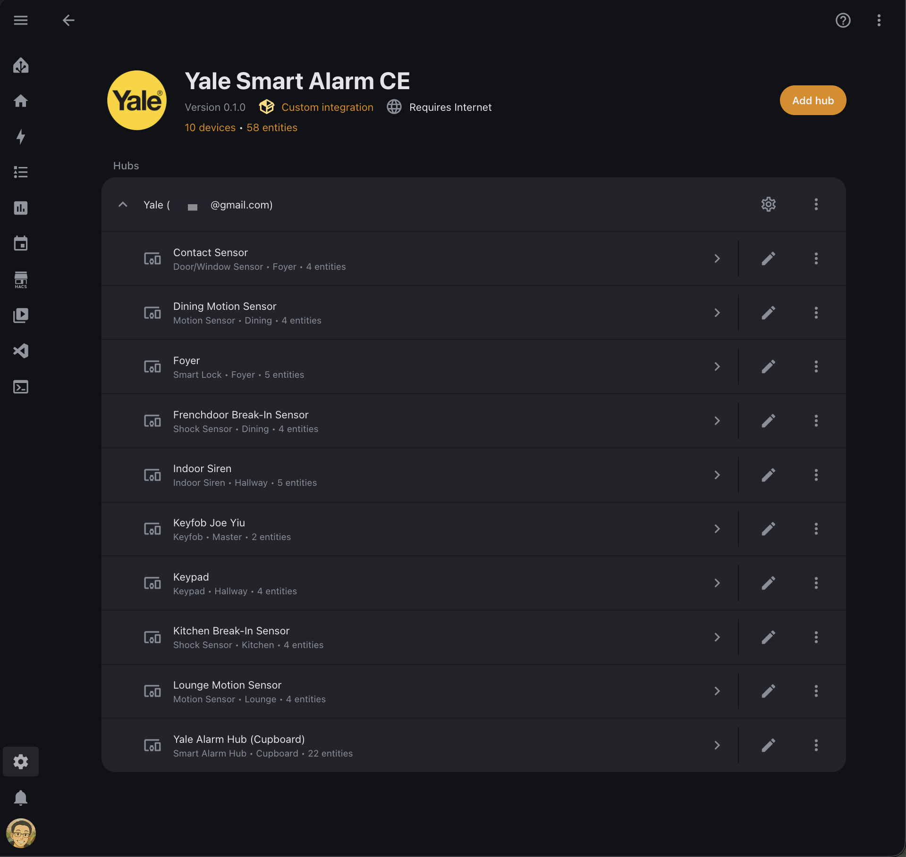

# Yale Smart Alarm CE - Custom Integration for Home Assistant

<div align="center">

<!-- Platform Badges -->


<!-- Status Badges -->


<!-- Community Badges -->


<!-- Support -->
[](https://buymeacoffee.com/hiallfyi)

**A custom integration for Yale Smart Alarm systems using the new Yale Home API (aaecosystem).**

**Zero third-party dependencies. Full device control.**

[Quick Start](#quick-start) • [Features](#features) • [Entities](#entities) • [Troubleshooting](#troubleshooting) • [Discussions](https://github.com/hiall-fyi/yale_smart_alarm_ce/discussions)

</div>

---

## Why This Integration?

In 2024–2025, Yale launched a **new range of Smart Alarm systems** that use the **Yale Home app** and a completely new API platform (aaecosystem). This new ecosystem is **NOT compatible** with the existing Home Assistant Yale Smart Alarm integration.

- The [official Yale Smart Living integration](https://www.home-assistant.io/integrations/yale_smart_alarm/) only works with the **older Yale Sync Smart Home Alarm** (discontinued)
- The new Yale Smart Alarm Hub uses a completely different API (`api.aaecosystem.com`)
- The official HA integration maintainer (@bdraco) [confirmed he won't be developing support](https://community.home-assistant.io/t/yale-smart-alarm/866759/7) for the new alarm ecosystem
- Many users have been [requesting this integration](https://community.home-assistant.io/t/yale-smart-alarm/866759) since March 2025

### Which Yale Alarm Do I Have?

| Feature | Old (Yale Sync/Smart Living) | New (Yale Home) |
|---------|------------------------------|-----------------|
| **App** | Yale Home View / Yale Smart Living | Yale Home |
| **API** | `mob.yalehomesystem.co.uk` | `api.aaecosystem.com` |
| **HA Integration** | Official `yale_smart_alarm` | **This custom integration** |
| **Still Sold** | ❌ Discontinued | ✅ Current |
| **Hub Model** | SR-320 / IA-320 | New Smart Alarm Hub |
 
---

## Quick Start

**Prerequisites:** Home Assistant 2025.11+ and a Yale account with Yale Home app access.

### 1. Install via HACS

[](https://my.home-assistant.io/redirect/hacs_repository/?owner=hiall-fyi&repository=yale_smart_alarm_ce&category=integration)

1. Click the button above (or add `https://github.com/hiall-fyi/yale_smart_alarm_ce` as a custom repository in HACS)
2. Install "Yale Smart Alarm CE"
3. Restart Home Assistant

<details>
<summary>Manual Installation</summary>

```bash
cp -r custom_components/yale_smart_alarm_ce /config/custom_components/
```
</details>

### 2. Add Integration & Authenticate

1. Go to **Settings → Devices & Services → Add Integration**
2. Search for "yale" and select **Yale Smart Alarm CE**
3. Choose your region, enter your Yale Home email and password, then hit **Submit**
4. Check your email for the verification code and enter it
5. Your devices will be automatically discovered

<div align="center">
  
  <p><em>Search for "yale" and pick Yale Smart Alarm CE</em></p>
</div>

<div align="center">
  
  <p><em>Enter your Yale Home credentials and select your region</em></p>
</div>

<div align="center">
  
  <p><em>Enter the verification code from your email</em></p>
</div>

### 3. Verify Success

Once set up, you'll see your Yale devices organized as separate devices:

- **Yale Alarm Hub** — Main hub with alarm control and system sensors
- **Individual Sensors** — Each door/window sensor, motion sensor, etc. as separate devices
- **Smart Locks** — Each lock as a separate device

<div align="center">
  
  <p><em>Your Yale devices organized by area</em></p>
</div>

<div align="center">
  
  <p><em>All entities at a glance from the integration card</em></p>
</div>

### 4. Configure Options

Click the **gear icon** on the integration card to customize the polling interval (default: 30 seconds, range: 10–300 seconds).

---

## Features

Full alarm control with MFA authentication, device-based organization, and comprehensive sensor support.

- **Alarm Control** — Arm Home, Arm Away, Disarm with multi-area support
- **Contact Sensors** — Door/window open/close detection (indoor, outdoor, shock)
- **Motion Sensors** — PIR motion detection (indoor and outdoor)
- **Smart Locks** — Lock/unlock control with door state, battery, and jammed detection
- **Battery Status** — Low battery alerts for all devices
- **Connectivity** — Online/offline status for all devices
- **Tamper Detection** — Tamper alerts for hub and devices
- **RF Jamming** — RF jamming detection on hub
- **Smoke Detection** — Smoke sensor fault/detection alerts
- **Panic Button** — RF panic button activation state
- **Volume Control** — Siren, chime, and trouble volume settings (OFF/LOW/MID/HIGH)
- **Hub Settings** — White LED, tamper detection, RF jam detection, force arm, cellular backup, WiFi, and more
- **Device Settings** — Entry/exit tones (sirens), proximity wakeup (keypads)
- **Multi-Region** — Global (EU, UK, US), China, Korea (Gateman), Australia/NZ (Lockwood)

### Comparison with Official Integration

| Feature | Official `yale_smart_alarm` | This Integration |
|---------|:---------------------------:|:----------------:|
| **New Yale Home Hub** | ❌ | ✅ |
| **Old Yale Sync Hub** | ✅ | ❌ |
| **MFA Support** | ❌ | ✅ |
| **Alarm Control** | ✅ | ✅ |
| **Contact Sensors** | ✅ | ✅ |
| **Motion Sensors** | — | ✅ |
| **Battery Status** | — | ✅ |
| **Tamper Detection** | — | ✅ |
| **RF Jamming Detection** | — | ✅ |
| **Device Connectivity** | — | ✅ |
| **Volume Controls** | — | ✅ |
| **Device Settings** | — | ✅ |
| **Smart Locks** | ⚠️ Basic | ✅ Full |
| **Smoke Sensors** | — | ✅ |
| **Device-based Organization** | — | ✅ |

*— = not verified for the official integration*

---

## Configuration

| Field | Description | Default |
|---|---|---|
| Email | Your Yale Home account email | — |
| Password | Your Yale Home account password | — |
| Region | Yale region (Global, China, Gateman, Lockwood) | Global |

### Options

| Option | Description | Default |
|---|---|---|
| Update Interval | How often to poll the Yale API (10–300 seconds) | 30s |

To update your password or region without removing the integration, click **Configure** on the integration card.

---

## Entities

### Alarm Hub

| Entity | Type | Description |
|---|---|---|
| Alarm | Alarm Control Panel | Arm Home / Arm Away / Disarm (multi-area) |
| Battery | Sensor | Hub battery level |
| Connected | Binary Sensor | Hub connectivity |
| Tamper | Binary Sensor | Hub tamper detection |
| RF Jamming | Binary Sensor | RF jamming detection |
| Alarm Triggered | Binary Sensor | Any area in alarm |
| Ethernet | Binary Sensor | Ethernet connectivity |
| Test Mode | Binary Sensor | Test mode active |
| Cellular Status | Sensor | Cellular connection status |
| Timezone | Sensor | Hub timezone |

### Hub Controls

| Entity | Type | Description |
|---|---|---|
| Siren / Chime / Trouble Volume | Select | OFF / LOW / MID / HIGH |
| White LED | Switch | Enable/disable white LED |
| Tamper Detection | Switch | Enable/disable tamper alerts |
| RF Jam Detection | Switch | Enable/disable RF jam detection |
| Force Arm | Switch | Allow arming with open sensors |
| Cellular Backup | Switch | Enable/disable cellular backup |
| WiFi | Switch | Enable/disable WiFi |
| Daylight Savings | Switch | Daylight savings adjustment |
| RF Supervisory | Switch | RF supervisory mode |
| Keypad Quickset | Switch | Keypad quickset mode |

### Per-Device Sensors

| Entity | Type | Applies To |
|---|---|---|
| Contact | Binary Sensor | Door/window sensors |
| Motion | Binary Sensor | PIR sensors |
| Smoke | Binary Sensor | Smoke sensors |
| Panic | Binary Sensor | RF panic buttons |
| Battery Low | Binary Sensor | All devices |
| Online | Binary Sensor | All devices |
| Tamper | Binary Sensor | Devices with tamper enabled |

### Per-Device Controls

| Entity | Type | Applies To |
|---|---|---|
| Volume | Select | Siren devices |
| Entry/Exit Tone | Switch | Siren devices |
| Proximity Wakeup | Switch | Keypads |

### Smart Lock

| Entity | Type | Description |
|---|---|---|
| Lock | Lock | Lock/unlock with transitional states (locking, unlocking, jammed) |
| Door | Binary Sensor | Door open/closed |
| Battery | Sensor | Lock battery level |
| Battery State | Sensor | Battery health state |

Disabled-by-default entities can be enabled in the entity settings.

---

## Supported Devices

| Device | Type | Support |
|--------|------|---------|
| Yale Smart Alarm Hub | Hub | ✅ Tested |
| Door/Window Contact Sensor | Contact | ✅ Tested |
| Outdoor Contact Sensor | Contact | ⚠️ Untested |
| Shock Sensor | Contact | ✅ Tested |
| Indoor Motion Sensor (PIR) | Motion | ✅ Tested |
| Outdoor Motion Sensor | Motion | ⚠️ Untested |
| Indoor Siren | Siren | ✅ Tested |
| Outdoor Siren | Siren | ⚠️ Untested |
| Keypad | Keypad | ✅ Tested |
| Keyfob | Keyfob | ✅ Tested (battery and connectivity only — no button press detection) |
| Smoke Sensor | Smoke | ⚠️ Untested |
| Panic Button | Button | ⚠️ Untested |
| Yale Smart Lock (Linus L2) | Lock | ✅ Tested |
| Yale Smart Lock (other models) | Lock | ⚠️ Untested |
| Yale Doorbell | Doorbell | ⚠️ Untested |

Devices marked ⚠️ are supported in code but haven't been verified with real hardware yet. If you have any of these, we'd love your help testing — see [#2](https://github.com/hiall-fyi/yale_smart_alarm_ce/issues/2).

### Regional Support

| Region | Coverage | Status |
|--------|----------|--------|
| Global | EU, UK, US | ✅ Tested |
| China | 中國 | ⚠️ Untested |
| Korea (Gateman) | 한국 | ⚠️ Untested |
| Australia/NZ (Lockwood) | AU, NZ | ⚠️ Untested |

---

## Limitations

| Limitation | Description |
|------------|-------------|
| Cloud-Only | All control goes through Yale's cloud servers |
| Polling Only | No real-time push notifications — the integration polls at your configured interval (default 30 seconds) |
| No Temperature Sensors | The Yale API returns temperature readings that can be months old with no indication, so they've been removed |
| MFA Required | Email verification required on first setup |
| Token Expiry | May need to re-authenticate periodically |
| No Schedule Management | Use Yale Home app for schedule changes |

---

## Troubleshooting

<details>
<summary><strong>Authentication Failed</strong></summary>

1. Ensure your email and password are correct
2. Check your email for the verification code (check spam/junk)
3. Make sure you're using the same credentials as the Yale Home app
4. Check **Settings → Repairs** for an "Authentication expired" repair issue

</details>

<details>
<summary><strong>Rate Limiting (HTTP 429)</strong></summary>

If you see "Rate limited" errors, try increasing the update interval in **Settings → Devices & Services → Yale Smart Alarm CE → Configure**. A repair issue will appear in **Settings → Repairs** when rate limiting is detected. This usually resolves automatically after a few minutes.

</details>

<details>
<summary><strong>Devices Not Showing</strong></summary>

1. Check Home Assistant logs for errors
2. Ensure your Yale system is online in the Yale Home app
3. Try removing and re-adding the integration

</details>

<details>
<summary><strong>Lock Showing Incorrect State</strong></summary>

The integration uses a last-known-state fallback when the API returns an invalid status — this prevents false "unlocked" readings. If the lock shows "unknown", no valid state has been received yet. Check the lock's battery level and connectivity.

</details>

<details>
<summary><strong>Enable Debug Logging</strong></summary>

Add to `configuration.yaml`:

```yaml
logger:
  default: info
  logs:
    custom_components.yale_smart_alarm_ce: debug
```

Restart Home Assistant and check **Settings → System → Logs**.

</details>

For other issues, check logs at **Settings → System → Logs** (filter by "yale_smart_alarm_ce") or [open an issue on GitHub](https://github.com/hiall-fyi/yale_smart_alarm_ce/issues).

---

## Automation Examples

<details>
<summary><strong>Notify when alarm is triggered</strong></summary>

```yaml
automation:
  - alias: "Yale alarm triggered"
    trigger:
      - platform: state
        entity_id: binary_sensor.yale_alarm_hub_alarm_triggered
        to: "on"
    action:
      - service: notify.mobile_app
        data:
          title: "🚨 Alarm Triggered!"
          message: "Your Yale alarm has been triggered."
          data:
            priority: high
```

</details>

<details>
<summary><strong>Arm away when everyone leaves</strong></summary>

```yaml
automation:
  - alias: "Arm alarm when away"
    trigger:
      - platform: state
        entity_id: zone.home
        to: "0"
        for: "00:05:00"
    action:
      - service: alarm_control_panel.alarm_arm_away
        target:
          entity_id: alarm_control_panel.yale_alarm
```

</details>

<details>
<summary><strong>Lock all doors when arming away</strong></summary>

```yaml
automation:
  - alias: "Lock doors on arm away"
    trigger:
      - platform: state
        entity_id: alarm_control_panel.yale_alarm
        to: "armed_away"
    action:
      - service: lock.lock
        target:
          entity_id:
            - lock.front_door
            - lock.back_door
```

</details>

<details>
<summary><strong>Low battery notification</strong></summary>

```yaml
automation:
  - alias: "Yale sensor low battery"
    trigger:
      - platform: state
        entity_id:
          - binary_sensor.front_door_battery_low
          - binary_sensor.back_door_battery_low
        to: "on"
    action:
      - service: notify.mobile_app
        data:
          message: "🔋 {{ trigger.to_state.attributes.friendly_name }} needs a battery replacement."
```

</details>

<details>
<summary><strong>Auto-lock door at night</strong></summary>

```yaml
automation:
  - alias: "Lock door at bedtime"
    trigger:
      - platform: time
        at: "23:00:00"
    condition:
      - condition: state
        entity_id: lock.yale_lock
        state: "unlocked"
    action:
      - service: lock.lock
        target:
          entity_id: lock.yale_lock
```

</details>

---

## Uninstall

1. Go to **Settings → Devices & Services → Yale Smart Alarm CE**
2. Click the **three-dot menu** (⋮) and select **Delete**
3. Restart Home Assistant
4. If installed via HACS: open **HACS → Integrations**, find Yale Smart Alarm CE, click the three-dot menu and **Remove**
5. If installed manually: delete the `custom_components/yale_smart_alarm_ce/` folder
6. Restart Home Assistant again

---

## Resources

- [Yale Smart Alarm - Community Request Thread](https://community.home-assistant.io/t/yale-smart-alarm/866759)
- [Official Yale Smart Living Integration](https://www.home-assistant.io/integrations/yale_smart_alarm/) (for old hubs only)
- [Yale Home App](https://apps.apple.com/app/yale-home/id1447926552) - iOS
- [Yale Home App](https://play.google.com/store/apps/details?id=com.assaabloy.yalehome) - Android
- [CHANGELOG.md](CHANGELOG.md) — Version history and release notes

---

## License

**GNU Affero General Public License v3.0 (AGPL-3.0)**

Free to use, modify, and distribute. Modifications must be open source under AGPL-3.0 with attribution.

**Original Author:** Joe Yiu ([@hiall-fyi](https://github.com/hiall-fyi))

See [LICENSE](LICENSE) for full details.

---

## Contributing

Contributions welcome!

1. Fork the repository
2. Create feature branch (`git checkout -b feature/AmazingFeature`)
3. Commit changes (`git commit -m 'Add AmazingFeature'`)
4. Push to branch (`git push origin feature/AmazingFeature`)
5. Open a Pull Request

Check out our [Discussions](https://github.com/hiall-fyi/yale_smart_alarm_ce/discussions) to share feature requests, ask questions, or help other users.

---

<div align="center">

[](https://star-history.com/#hiall-fyi/yale_smart_alarm_ce&Date)

</div>

<details>
<summary><strong>Disclaimer</strong></summary>

This project is not affiliated with, endorsed by, or connected to Yale or ASSA ABLOY. Yale and the Yale logo are registered trademarks of ASSA ABLOY. Home Assistant is a trademark of Nabu Casa, Inc.

This integration controls physical security devices — locks, alarms, and sensors. While every effort has been made to ensure reliability, no software is bug-free. The developer cannot be held responsible for any issues arising from its use, including but not limited to false alarm states, unintended lock/unlock actions, missed sensor alerts, or any other unexpected behaviour. Use it at your own risk, and always keep the Yale Home app available as a backup.

This integration is provided "as is" without warranty of any kind.

</details>
