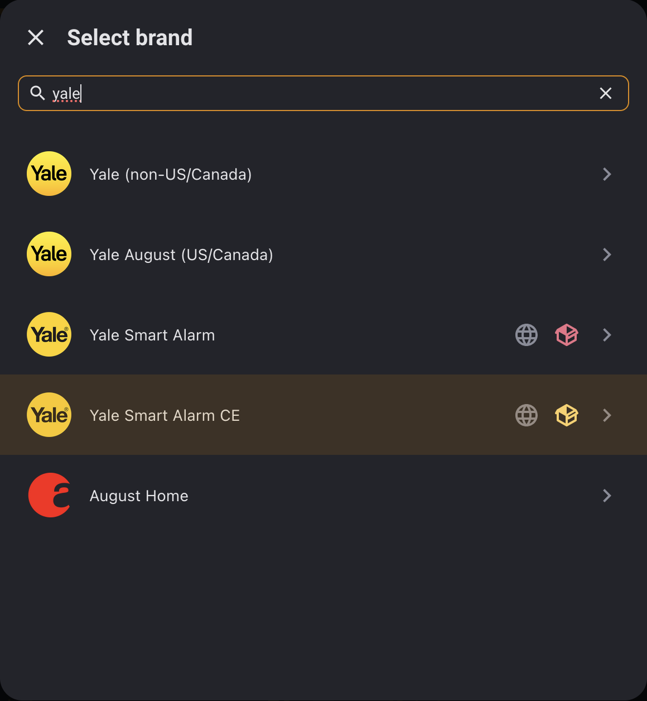
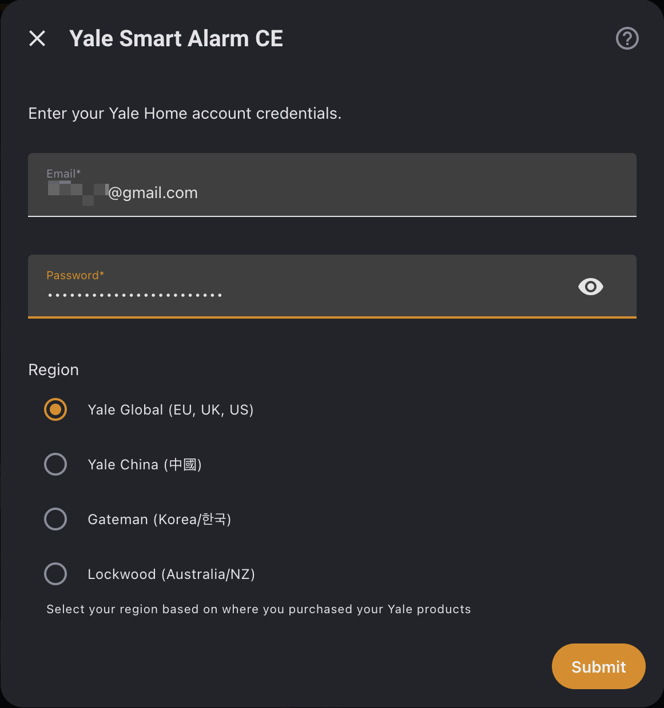
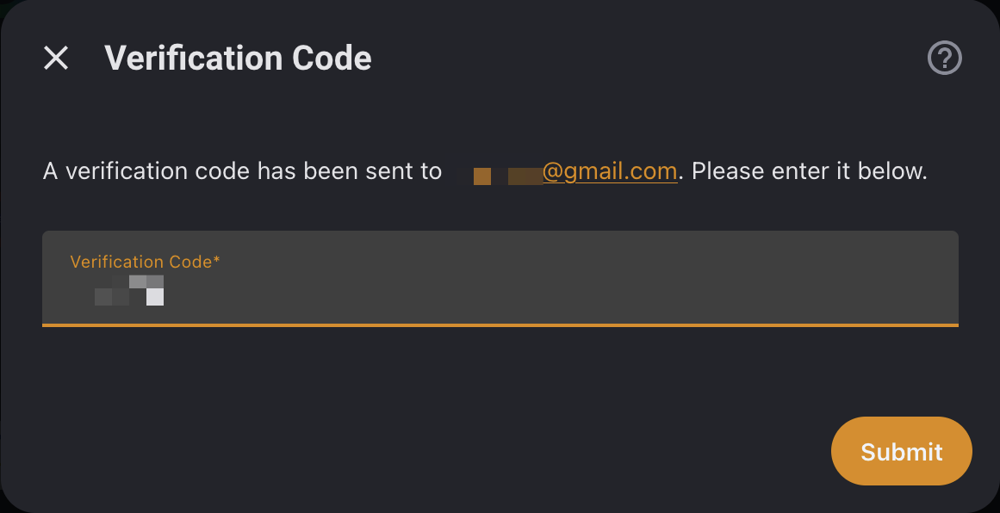
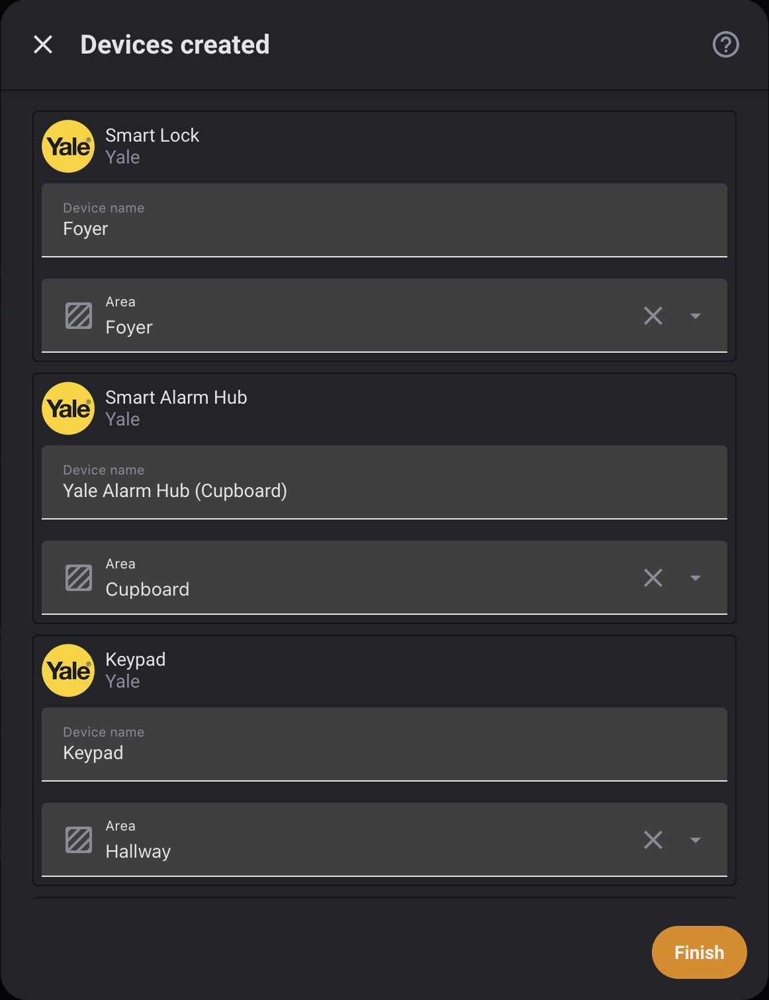
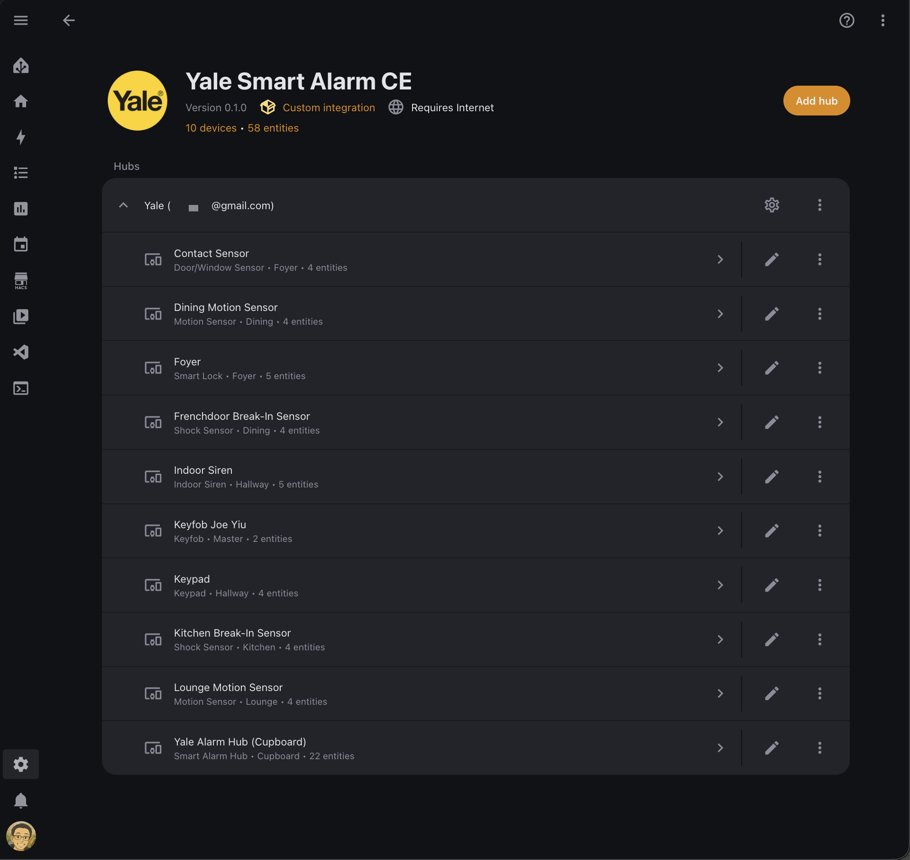

# Yale Smart Alarm CE — Home Assistant integration

<div align="center">

<!-- Platform Badges -->


<!-- Status Badges -->


<!-- Community Badges -->


<!-- Support -->
[](https://buymeacoffee.com/hiallfyi)

A Home Assistant integration for the new Yale Smart Alarm range — the hubs that pair with the Yale Home app and the `aaecosystem` cloud.

[Quick Start](#quick-start) • [Features](#features) • [Entities](#entities) • [Supported Devices](#supported-devices) • [Troubleshooting](#troubleshooting) • [Discussions](https://github.com/hiall-fyi/yale_smart_alarm_ce/discussions)

</div>

---

## Why this integration exists

Yale split their alarm line in 2024–2025. The newer hubs use the Yale Home app and a different cloud platform (`api.aaecosystem.com`), and the [official Home Assistant integration](https://www.home-assistant.io/integrations/yale_smart_alarm/) only speaks to the older Yale Sync hardware. The official maintainer has [said publicly](https://community.home-assistant.io/t/yale-smart-alarm/866759/7) that the new range isn't on their roadmap, and the [community thread](https://community.home-assistant.io/t/yale-smart-alarm/866759) has been asking for support since March 2025.

This integration fills that gap. It talks directly to the new cloud, no third-party libraries required.

### Which Yale alarm do you have?

| | Old (Yale Sync / Smart Living) | New (Yale Home) |
|---|---|---|
| App | Yale Home View / Yale Smart Living | Yale Home |
| Cloud | `mob.yalehomesystem.co.uk` | `api.aaecosystem.com` |
| HA integration | Official `yale_smart_alarm` | This integration |
| Hub model | SR-320 / IA-320 | Newer Smart Alarm Hub |
| Still sold | ❌ Discontinued | ✅ Current |

If you bought your hub recently and use the Yale Home app, you want this integration.

---

## Quick start

**You'll need:** Home Assistant 2025.11 or newer, and a Yale account that already works with the Yale Home app.

### 1. Install via HACS

[](https://my.home-assistant.io/redirect/hacs_repository/?owner=hiall-fyi&repository=yale_smart_alarm_ce&category=integration)

1. Click the badge above, or add `https://github.com/hiall-fyi/yale_smart_alarm_ce` as a custom repository in HACS.
2. Install **Yale Smart Alarm CE**.
3. Restart Home Assistant.

<details>
<summary>Manual install</summary>

```bash
cp -r custom_components/yale_smart_alarm_ce /config/custom_components/
```

Restart Home Assistant after copying.
</details>

### 2. Add the integration

1. Go to **Settings → Devices & Services → Add Integration**.
2. Search for **yale** and pick **Yale Smart Alarm CE**.
3. Choose your region, then enter your Yale Home email and password.
4. Yale will email you a verification code — enter it.
5. Your devices show up automatically.

<div align="center">
  
  <p><em>Search for "yale" and pick Yale Smart Alarm CE</em></p>
</div>

<div align="center">
  
  <p><em>Yale Home credentials and region</em></p>
</div>

<div align="center">
  
  <p><em>Verification code from email</em></p>
</div>

### 3. Confirm everything turned up

Each piece of hardware appears as its own device:

- **Yale Alarm Hub** — alarm panel and hub-level diagnostics.
- **Sensors** — one device per door / window / motion / smoke / panic sensor.
- **Smart locks** — one device per lock.
- **Doorbell** — if you have one paired.

<div align="center">
  
  <p><em>Yale devices grouped by your Home Assistant areas</em></p>
</div>

<div align="center">
  
  <p><em>All entities visible from the integration card</em></p>
</div>

### 4. Adjust the polling interval (optional)

Click the gear icon on the integration card. The default is 30 seconds; you can set anything between 10 and 300. Faster polling means quicker state updates but more API calls.

---

## Features

### Alarm

- Arm Home, Arm Away, and Disarm — with a separate panel per area on multi-area systems.
- An "Arming" transitional state during the exit-delay countdown, plus an `exit_delay_end` attribute for automations.
- A `yale_smart_alarm_ce.force_arm` service for arming with open sensors. When it's blocked, the message names the sensors (e.g. `Cannot arm — Front Door (open)`).
- A `yale_smart_alarm_ce_arm_blocked` event when arming is blocked, so automations can react (close a door, notify a phone, retry).

### Sensors and devices

- Door / window contact sensors, including outdoor and shock variants.
- Smoke sensors with fault and detection state.
- Panic buttons (RF).
- PIR motion sensors at the device level — battery, connectivity, tamper. The per-sensor motion state isn't currently exposed; see [Limitations](#limitations).
- Doorbell press detection.

### Locks

- Lock and unlock with door state, jammed detection, and transitional `locking` / `unlocking` states.
- Battery percentage and battery health on locks that report it.
- Lock state is preserved through transient API errors — no false "unlocked" readings while the cloud reconnects.

### Hub diagnostics

- Battery, connectivity, tamper, RF jamming, and an "any area in alarm" binary sensor.
- Ethernet, cellular, and test-mode status; timezone reported by the hub.
- Repair issues for authentication expiry and rate limiting under **Settings → Repairs**.

### Settings and controls

- Hub volume controls — siren, chime, and trouble (OFF / LOW / MID / HIGH).
- Hub feature switches — White LED, tamper detection, RF jam detection, force-arm allowed, cellular backup, WiFi, daylight savings, RF supervisory, keypad quickset.
- Per-siren volume.
- Indoor sirens — entry / exit tone switch.
- Outdoor sirens — Comfort LED and Strobe Light switches.
- Keypads — proximity wakeup switch.

### Setup and reliability

- Multi-region support: Global (EU, UK, US), China, Gateman (Korea), and Lockwood (Australia / NZ).
- MFA-aware setup. The integration keeps the same install ID across re-authentication, so Yale only emails you a fresh verification code when it genuinely needs one.
- Reconfigure flow — change your password or region from the integration card without removing the integration.
- Diagnostics download with sensitive fields redacted automatically (PIN codes, lock user names, encryption keys, serial numbers, bridge identifiers, account email).
- Automatic retry with randomised backoff on transient failures, and `Retry-After` honoured on rate-limit responses.

---

## Configuration

| Field | Description | Default |
|---|---|---|
| Email | Your Yale Home account email | — |
| Password | Your Yale Home account password | — |
| Region | Yale region (Global, China, Gateman, Lockwood) | Global |

### Options

| Option | Description | Default |
|---|---|---|
| Update Interval | How often to poll the Yale cloud (10–300 seconds) | 30s |

To change your password or region without removing the integration, click **Configure** on the integration card.

---

## Entities

### Alarm hub

| Entity | Type | Description |
|---|---|---|
| Alarm | Alarm Control Panel | Arm Home / Arm Away / Disarm, per area on multi-area systems |
| Alarm Triggered | Binary Sensor | Any area currently in alarm |
| Battery | Sensor | Hub battery percentage |
| Connected | Binary Sensor | Hub connectivity |
| Tamper | Binary Sensor | Hub tamper detection |
| RF Jamming | Binary Sensor | RF jamming detection |
| Ethernet | Binary Sensor | Ethernet connectivity |
| Test Mode | Binary Sensor | Test mode active |
| Cellular Status | Sensor | Cellular connection status |
| Timezone | Sensor | Hub-reported timezone |

### Hub controls

| Entity | Type | Description |
|---|---|---|
| Siren / Chime / Trouble Volume | Select | OFF / LOW / MID / HIGH |
| White LED | Switch | Toggle the white status LED |
| Tamper Detection | Switch | Toggle hub tamper alerts |
| RF Jam Detection | Switch | Toggle RF jam detection |
| Force Arm | Switch | Allow arming with open sensors |
| Cellular Backup | Switch | Toggle cellular backup |
| WiFi | Switch | Toggle WiFi |
| Daylight Savings | Switch | Daylight savings adjustment |
| RF Supervisory | Switch | RF supervisory mode |
| Keypad Quickset | Switch | Keypad quickset mode |

### Per-device sensors

| Entity | Type | Applies to |
|---|---|---|
| Contact | Binary Sensor | Door / window sensors |
| Smoke | Binary Sensor | Smoke sensors |
| Panic | Binary Sensor | RF panic buttons |
| Battery Low | Binary Sensor | All devices |
| Online | Binary Sensor | All devices |
| Tamper | Binary Sensor | Devices with tamper enabled |

### Per-device controls

| Entity | Type | Applies to |
|---|---|---|
| Volume | Select | Sirens |
| Entry / Exit Tone | Switch | Indoor sirens |
| Comfort LED | Switch | Outdoor sirens |
| Strobe Light | Switch | Outdoor sirens |
| Proximity Wakeup | Switch | Keypads |

### Smart lock

| Entity | Type | Description |
|---|---|---|
| Lock | Lock | Lock / unlock with `locking`, `unlocking`, and `jammed` states |
| Door | Binary Sensor | Door open / closed |
| Battery | Sensor | Lock battery percentage |
| Battery State | Sensor | Battery health state |

### Doorbell

| Entity | Type | Description |
|---|---|---|
| Ding | Binary Sensor | Doorbell press detection |

Disabled-by-default entities can be turned on from the entity settings page.

---

## Supported devices

Some devices were tested directly during development; others were confirmed by beta testers running the integration against their own hardware. Anything marked **Untested** is supported in code but hasn't been confirmed live yet — reports welcome.

| Device | Type | Status |
|---|---|---|
| Yale Smart Alarm Hub | Hub | ✅ Tested |
| Yale Smart Alarm Hub (Lite) | Hub | ✅ Community verified |
| Door / Window Contact Sensor | Contact | ✅ Tested |
| Outdoor Contact Sensor | Contact | ✅ Community verified |
| Shock Sensor | Contact | ✅ Tested |
| Indoor Motion Sensor (PIR) | Motion | ⚠️ Partial (see [Limitations](#limitations)) |
| Outdoor Motion Sensor | Motion | ⚠️ Partial (see [Limitations](#limitations)) |
| Indoor Siren | Siren | ✅ Tested |
| Outdoor Siren | Siren | ✅ Community verified |
| Keypad | Keypad | ✅ Tested |
| Keyfob | Keyfob | ✅ Tested (battery and connectivity only) |
| Smoke Sensor | Smoke | ✅ Community verified |
| Panic Button | Button | ⚠️ Untested |
| Yale Linus L2 | Lock | ✅ Tested |
| Yale Conexis L1 / L2 | Lock | ✅ Community verified |
| Yale Keyless Connected | Lock | ✅ Community verified |
| Yale Smart Safe (YSS/250/EB1) | Lock | ✅ Community verified |
| Yale Smart Lock (other models) | Lock | ⚠️ Untested |
| Yale Doorbell | Doorbell | ⚠️ Untested |

If you've got hardware on the Untested list, please post in [Discussions](https://github.com/hiall-fyi/yale_smart_alarm_ce/discussions) — confirming a device works (or doesn't) helps everyone.

### Regional support

| Region | Coverage | Status |
|---|---|---|
| Global | EU, UK, US | ✅ Tested |
| China | 中國 | ⚠️ Untested |
| Korea (Gateman) | 한국 | ⚠️ Untested |
| Australia / NZ (Lockwood) | AU, NZ | ⚠️ Untested |

---

## Limitations

| Limitation | Detail |
|---|---|
| Cloud-only | Every command goes through Yale's cloud. Local control isn't possible — the hubs don't expose a local API. |
| Polling | The integration polls the Yale cloud at your configured interval; there's no real-time push. State changes show up on the next poll. |
| No PIR motion entity | Motion events are only sent over Yale's real-time push channel, which this integration doesn't speak yet, so a per-sensor motion entity would always read "Clear" and mislead. PIR devices still appear with battery, connectivity, and tamper — and if a PIR triggers the alarm, the alarm panel shows triggered correctly. |
| No temperature sensors | The Yale cloud returns temperature readings that can be months old with no staleness signal. They're not exposed to avoid showing wrong data. |
| Settings need disarmed | The Yale API rejects most setting changes while the alarm is armed (HTTP 412). Disarm first, then change. The exception is arming itself — `yale_smart_alarm_ce.force_arm` handles the open-sensor case. |
| MFA on first setup | Yale emails a verification code the first time you connect from a new device. After that, the same install ID is reused. |
| Token expiry | The integration handles re-authentication automatically; on the rare occasion it can't, a repair issue appears under **Settings → Repairs**. |
| No schedule editing | Use the Yale Home app to edit alarm schedules. |

---

## Troubleshooting

<details>
<summary><strong>Authentication failed</strong></summary>

1. Check email and password by logging into the Yale Home app first.
2. Look in your email for the verification code (including spam / junk).
3. If it keeps failing, check **Settings → Repairs** for an Authentication Expired entry and re-authenticate from there.

</details>

<details>
<summary><strong>Rate limited (HTTP 429)</strong></summary>

The integration honours Yale's `Retry-After` automatically and a repair issue appears under **Settings → Repairs** while it's active. If it keeps happening, raise the polling interval in **Settings → Devices & Services → Yale Smart Alarm CE → Configure**.

</details>

<details>
<summary><strong>Devices missing or showing as unavailable</strong></summary>

1. Check the Yale Home app — if your hub is offline there, it won't show in HA either.
2. Check Home Assistant logs for `yale_smart_alarm_ce` errors.
3. Reload the integration from its three-dot menu before removing and re-adding.

</details>

<details>
<summary><strong>Lock state looks wrong</strong></summary>

When the Yale cloud returns an invalid status, the integration keeps the last valid state instead of swinging to "unlocked". If you see `unknown`, the lock hasn't reported a valid state yet — check the lock's battery and Bluetooth bridge connection.

</details>

<details>
<summary><strong>Enable debug logging</strong></summary>

Add this to `configuration.yaml` and restart:

```yaml
logger:
  default: info
  logs:
    custom_components.yale_smart_alarm_ce: debug
```

Then check **Settings → System → Logs**, filtered by `yale_smart_alarm_ce`.

</details>

For anything else, [open an issue](https://github.com/hiall-fyi/yale_smart_alarm_ce/issues) with a diagnostics download (it's redacted automatically) and a few minutes of debug logs covering the problem.

---

## Automation examples

<details>
<summary><strong>Notify when the alarm triggers</strong></summary>

```yaml
automation:
  - alias: "Yale alarm triggered"
    trigger:
      - platform: state
        entity_id: binary_sensor.yale_alarm_hub_alarm_triggered
        to: "on"
    action:
      - service: notify.mobile_app
        data:
          title: "🚨 Alarm Triggered"
          message: "Your Yale alarm has been triggered."
          data:
            priority: high
```

</details>

<details>
<summary><strong>Arm Away when everyone leaves</strong></summary>

```yaml
automation:
  - alias: "Arm alarm when away"
    trigger:
      - platform: state
        entity_id: zone.home
        to: "0"
        for: "00:05:00"
    action:
      - service: alarm_control_panel.alarm_arm_away
        target:
          entity_id: alarm_control_panel.yale_alarm
```

</details>

<details>
<summary><strong>Lock all doors when arming Away</strong></summary>

```yaml
automation:
  - alias: "Lock doors on arm away"
    trigger:
      - platform: state
        entity_id: alarm_control_panel.yale_alarm
        to: "armed_away"
    action:
      - service: lock.lock
        target:
          entity_id:
            - lock.front_door
            - lock.back_door
```

</details>

<details>
<summary><strong>Low-battery notification</strong></summary>

```yaml
automation:
  - alias: "Yale sensor low battery"
    trigger:
      - platform: state
        entity_id:
          - binary_sensor.front_door_battery_low
          - binary_sensor.back_door_battery_low
        to: "on"
    action:
      - service: notify.mobile_app
        data:
          message: "🔋 {{ trigger.to_state.attributes.friendly_name }} needs a battery replacement."
```

</details>

<details>
<summary><strong>Auto-lock at night</strong></summary>

```yaml
automation:
  - alias: "Lock door at bedtime"
    trigger:
      - platform: time
        at: "23:00:00"
    condition:
      - condition: state
        entity_id: lock.yale_lock
        state: "unlocked"
    action:
      - service: lock.lock
        target:
          entity_id: lock.yale_lock
```

</details>

---

## Uninstall

1. **Settings → Devices & Services → Yale Smart Alarm CE**, click the three-dot menu and pick **Delete**.
2. Restart Home Assistant.
3. If installed via HACS: open **HACS → Integrations**, find Yale Smart Alarm CE, and pick **Remove** from its three-dot menu.
4. If installed manually: delete the `custom_components/yale_smart_alarm_ce/` folder from your config.
5. Restart Home Assistant once more.

---

## Resources

- [Yale Smart Alarm — Home Assistant community thread](https://community.home-assistant.io/t/yale-smart-alarm/866759)
- [Official Yale Smart Living integration](https://www.home-assistant.io/integrations/yale_smart_alarm/) — for the older Yale Sync hubs only
- [Yale Home app — iOS](https://apps.apple.com/app/yale-home/id1447926552)
- [Yale Home app — Android](https://play.google.com/store/apps/details?id=com.assaabloy.yalehome)
- [CHANGELOG.md](CHANGELOG.md) — version history

---

## License

**GNU Affero General Public License v3.0 (AGPL-3.0)**

Free to use, modify, and distribute. Modifications must be open source under AGPL-3.0 with attribution.

**Author:** Joe Yiu ([@hiall-fyi](https://github.com/hiall-fyi))

See [LICENSE](LICENSE) for full details.

---

## Contributing

Contributions are welcome. The usual flow:

1. Fork the repository.
2. Create a feature branch — `git checkout -b feature/your-change`.
3. Commit your work.
4. Push and open a Pull Request.

Feature ideas and questions are best raised in [Discussions](https://github.com/hiall-fyi/yale_smart_alarm_ce/discussions). Bug reports go in [Issues](https://github.com/hiall-fyi/yale_smart_alarm_ce/issues) — a diagnostics download and a snippet of debug logs go a long way.

---

<div align="center">

[](https://star-history.com/#hiall-fyi/yale_smart_alarm_ce&Date)

</div>

<details>
<summary><strong>Disclaimer</strong></summary>

This project isn't affiliated with, endorsed by, or connected to Yale or ASSA ABLOY. Yale and the Yale logo are registered trademarks of ASSA ABLOY. Home Assistant is a trademark of Nabu Casa, Inc.

This integration controls physical security devices — locks, alarms, and sensors. Every effort has been made to ensure it behaves correctly, but no software is bug-free. The author can't be held responsible for any issues arising from its use, including false alarm states, unintended lock or unlock actions, missed sensor alerts, or any other unexpected behaviour. Use it at your own risk, and keep the Yale Home app available as a backup.

This integration is provided "as is" without warranty of any kind.

</details>
